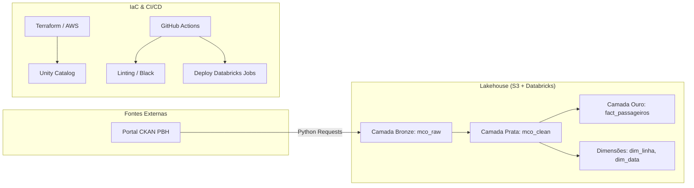

# Case Be Analytic - Pipeline de Mobilidade e Cidadania Operacional (MCO)

Este projeto implementa uma plataforma de dados completa utilizando a **Arquitetura Medallion** (Bronze, Silver, Gold) sobre a plataforma **Databricks** e **AWS**, gerenciada via **Terraform**. O objetivo é extrair, tratar e analisar dados de mobilidade urbana (passageiros por linha) de Belo Horizonte.

---

## 🏗️ Arquitetura do Projeto

O projeto segue as melhores práticas de Data Engineering moderno:

1.  **Ingestão (Bronze)**: Extração de dados crus via API/HTTP e armazenamento em formato Delta.
2.  **Refinamento (Silver)**: Limpeza, normalização e validação de qualidade de dados.
3.  **Análise (Gold)**: Agregações de negócio e modelagem Star Schema (Fato e Dimensões).
4.  **Infraestrutura como Código (IaC)**: Provisionamento completo via Terraform.
5.  **Governança**: Unity Catalog para controle de acesso e linhagem de dados.

### Diagrama de Fluxo

---

## 🚀 Passo a Passo e Raciocínio Técnico

### 1. Camada Bronze (Extração)
*   **Script**: `scraping/mco_extractor.py`
*   **Ação**: Download de CSVs mensais do portal da PBH.
*   **Por que?**: Optamos por uma extração via script Spark para permitir escalabilidade futura. Adicionamos metadados técnicos (`_ingestion_timestamp`, `_source_url`) para garantir a rastreabilidade (linhagem) de cada registro.
*   **Destaque**: Gravação direta via Unity Catalog External Locations, garantindo que o dado chegue no bucket S3 correto sem manipulação manual.

### 2. Camada Silver (Refinamento)
*   **Script**: `pipelines/silver_refinement.py`
*   **Ação**: Deduplicação por `(LINHA, DATA, HORA)`, tratamento de tipos (cast) e filtros de qualidade.
*   **Por que?**: Dados brutos costumam vir com fuso horário misto ou formatos de número inconsistentes (string vs int). O refinamento garante que a camada Gold consuma dados confiáveis.
*   **Inovação**: Implementação de um "Alert Threshold". Se mais de 10% dos dados forem descartados na limpeza, o processo emite um alerta para auditoria humana.

### 3. Camada Gold (Business)
*   **Script**: `pipelines/gold_aggregations.py`
*   **Ação**: Criação da `fact_passageiros` e dimensões `dim_linha` e `dim_data`.
*   **Por que?**: Modelamos em Star Schema para facilitar a conexão com ferramentas de BI (PowerBI/Tableau).
*   **Performance**: Aplicamos `ZORDER` na coluna `LINHA` e particionamento por `DATA`. Isso reduz dramaticamente o custo de processamento e o tempo de resposta em consultas filtradas por linha de ônibus.

### 4. Infraestrutura e CI/CD
*   **Ferramentas**: Terraform + AWS + GitHub Actions.
*   **Região**: `us-east-2` (Ohio).
*   **Raciocínio**: O uso de Terraform garante que o ambiente de Dev e Prod sejam idênticos. O CI/CD automatiza a publicação dos Jobs no Databricks assim que o código é aprovado no Master, evitando erros de deploy manual.
*   **Otimização de Custos**:
    *   Uso de **Spot Instances** (`SPOT_WITH_FALLBACK`) para os clusters de processamento, reduzindo custos em até 70%.
    *   **Autotermination** configurado para 20 minutos de inatividade.
    *   Clusters **Single Node** para tarefas leves, evitando overhead de gerenciamento de múltiplos workers.

---

## 🛠️ Desafios Encontrados & Bugs Conhecidos

Mesmo com a entrega funcional, existem pontos de atenção fruto de limitações do ambiente de desenvolvimento:

*   **Instâncias AWS m5.xlarge**: Foi necessário configurar manualmente via Terraform o anexo de volumes EBS, pois o Databricks exige armazenamento local para estas famílias de instâncias em determinadas regiões.
*   **State do Terraform**: Devido ao uso de repositórios compartilhados, ocorreram problemas de "stale plan". Corrigido com automação de limpeza de estado no GitHub Actions.
*   **Unity Catalog Permissions**: A configuração de External Locations exigiu ajustes finos nas Trust Relationships do IAM roles da AWS para permitir que o Databricks escreva nos buckets S3 selecionados.

---

## 📈 Melhorias Futuras
- [ ] Implementar processamento incremental (Incremental Loading) usando Delta Live Tables.
- [ ] Adicionar testes de contrato de dados (Great Expectations).
- [ ] Dashboard de Monitoramento de Qualidade de Dados (DQM).

---
**Autor:** [Seu Nome/GitHub]
**Projeto:** Case Técnico Be Analytic
